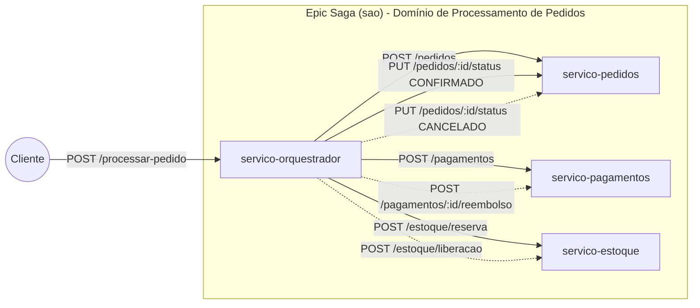
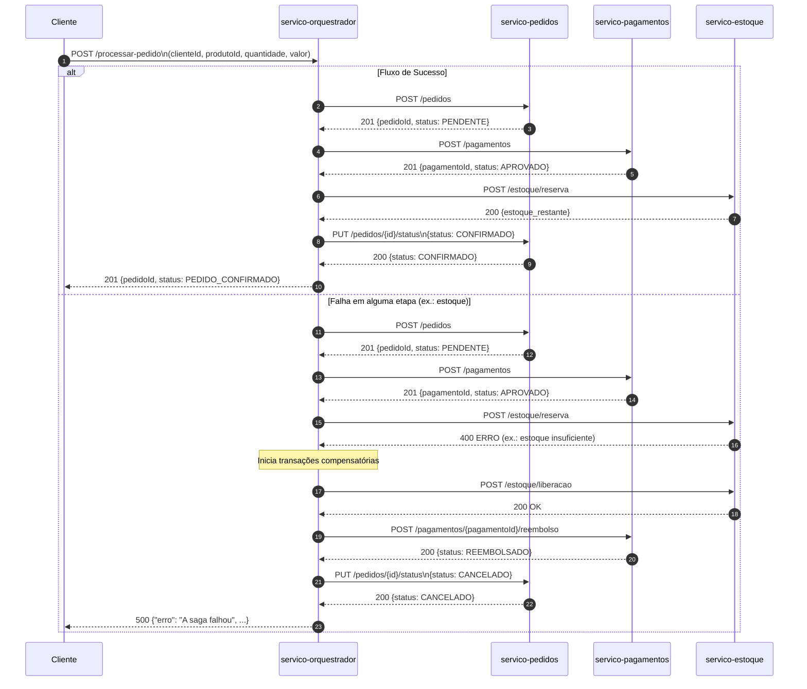

# 📘 **README – Projeto Saga Transacional (Epic Saga – Orquestrada)**

### Engenharia de Computação – Sistemas Distribuídos

### Simulação de Processamento de Pedidos em Microserviços

Alunos: Víctor Teixeira e Sthéphany Vidal

---

## 📌 **1. Objetivo**

Este projeto implementa uma simulação completa do padrão **Epic Saga (SAO)** utilizando **microserviços** independentes que executam etapas do processamento de um pedido em um sistema de e-commerce.

A saga garante consistência entre os serviços por meio de:

* **Transações locais**
* **Compensações em caso de falha**
* **Orquestração centralizada**
* **Comunicação síncrona entre microserviços**

A solução foi construída conforme o enunciado do exercício oficial. 

---

## 📦 **2. Arquitetura do Sistema**

O sistema é composto por **4 microserviços** independentes:

| Serviço                  | Função                        | Porta |
| ------------------------ | ----------------------------- | ----- |
| **servico-orquestrador** | Coordena toda a saga          | 3000  |
| **servico-pedidos**      | Cria pedidos e altera status  | 3001  |
| **servico-pagamentos**   | Processa e estorna pagamentos | 3002  |
| **servico-estoque**      | Reserva e libera estoque      | 3003  |

---

## 🔄 **3. Fluxo Completo da Saga**

## 🟢 Fluxo de Execução com Sucesso

### 1. Cliente dispara a Saga

* O cliente envia:
  `POST /processar-pedido` (no **servico-orquestrador**)

  ```json
  {
    "clienteId": "cliente-123",
    "produtoId": "produto-abc",
    "quantidade": 1,
    "valor": 150.00
  }
  ```

### 2. Orquestrador cria o pedido

* Orquestrador chama o **servico-pedidos**:
  `POST /pedidos`
* O serviço de pedidos cria um registro em memória com status **PENDENTE** e devolve algo como:

  ```json
  {
    "pedidoId": "pedido-123",
    "status": "PENDENTE",
    ...
  }
  ```
* O orquestrador guarda esse `pedidoId` para o resto da Saga.

### 3. Orquestrador processa o pagamento

* Chamada ao **servico-pagamentos**:
  `POST /pagamentos`

  ```json
  {
    "pedidoId": "pedido-123",
    "produtoId": "produto-abc",
    "valor": 150.00
  }
  ```
* O serviço de pagamentos aprova o pagamento (não cai em nenhuma regra de falha) e retorna:

  ```json
  {
    "pagamentoId": "pag-xyz",
    "status": "APROVADO"
  }
  ```
* O orquestrador também guarda esse `pagamentoId`.

### 4. Orquestrador reserva o estoque

* Agora chama o **servico-estoque**:
  `POST /estoque/reserva`

  ```json
  {
    "pedidoId": "pedido-123",
    "produtoId": "produto-abc",
    "quantidade": 1
  }
  ```
* O serviço de estoque verifica se há quantidade suficiente e debita 1 unidade:

  ```json
  {
    "produtoId": "produto-abc",
    "estoque_restante": 99
  }
  ```

### 5. Orquestrador confirma o pedido

* Como todas as etapas deram certo, o orquestrador finaliza a Saga alterando o status do pedido:
  `PUT /pedidos/{id}/status` no **servico-pedidos**:

  ```json
  {
    "status": "CONFIRMADO"
  }
  ```

### 6. Resposta final para o cliente

* O orquestrador responde para o cliente com **201 Created**:

  ```json
  {
    "pedidoId": "pedido-123",
    "status": "PEDIDO_CONFIRMADO"
  }
  ```

🔎 **Do ponto de vista do negócio**, parece uma transação única e atômica: pedido criado, pago e com estoque reservado, tudo consistente.

---

## 🔴 Fluxo com Falha e Transações Compensatórias

A ideia da Saga é:

> **Se qualquer etapa falhar, o orquestrador desfaz (compensa) as etapas anteriores na ordem inversa.**

Pelo enunciado, você tem três formas clássicas de induzir falha: 

* `produtoId: 0` → falha no **serviço de pedidos**
* `valor: 1000` → falha no **serviço de pagamentos**
* `quantidade: 500` → falha no **serviço de estoque**

Vou detalhar dois cenários bem didáticos.

---

### 🟥 Cenário 1 – Falha no Pagamento (antes de mexer no estoque)

1. Cliente chama `POST /processar-pedido` no orquestrador com `valor = 1000`.

2. **Criação do pedido**

   * Orquestrador chama `POST /pedidos`.
   * Pedido é criado com status `PENDENTE`.
   * Até aqui, tudo certo.

3. **Processamento do pagamento**

   * Orquestrador chama `POST /pagamentos` com `valor = 1000`.
   * O `servico-pagamentos` detecta a condição de falha e responde `400 Bad Request` (pagamento recusado).

4. **Orquestrador detecta erro**

   * Como deu erro no pagamento, o orquestrador **não chama o estoque** e entra direto no fluxo de compensação.

5. **Compensação (nesse cenário só pedido foi criado)**

   * Não há pagamento aprovado, logo não tem reembolso.
   * Não há reserva de estoque, então nada para liberar.
   * O orquestrador apenas **cancela o pedido**:
     `PUT /pedidos/{id}/status` com `{ "status": "CANCELADO" }`.

6. **Resposta final para o cliente**

   * O orquestrador responde com **500** (ou 4xx, se você preferir) informando que a Saga falhou:

     ```json
     {
       "erro": "A saga falhou",
       "motivo": "Pagamento recusado",
       "pedidoId": "pedido-123"
     }
     ```

👉 Resultado: o pedido fica como **CANCELADO**, sem pagamento aprovado, sem mexer em estoque. Sistema consistente.

---

### 🟥 Cenário 2 – Falha no Estoque (após pagamento aprovado)

1. Cliente chama `POST /processar-pedido` com uma `quantidade` que força falha no estoque (ex: `quantidade: 500`).

2. **Cria o pedido**

   * `POST /pedidos` → status `PENDENTE`.

3. **Processa o pagamento**

   * `POST /pagamentos` → pagamento **APROVADO** (sucesso).

4. **Tenta reservar estoque**

   * `POST /estoque/reserva` com `quantidade: 500`.
   * O `servico-estoque` detecta que não há quantidade suficiente e responde `400 Bad Request`.

5. **Orquestrador detecta falha após já ter pago e criado pedido**
   Agora ele precisa desfazer o que já fez, em **ordem inversa**:

   #### 5.1. Compensação no Estoque

   * Se a reserva chegou a ser feita antes de uma falha posterior (ex.: falha em outro serviço depois do estoque), você chamaria:
     `POST /estoque/liberacao`

     ```json
     {
       "pedidoId": "pedido-123",
       "produtoId": "produto-abc",
       "quantidade": 500
     }
     ```
   * Nesse caso específico (falhou *ao* reservar), provavelmente nem chegou a debitar, então essa etapa pode ser opcional dependendo de como você implementa.

   #### 5.2. Reembolso do pagamento

   * Como existe um pagamento **APROVADO**, precisa compensar:
     `POST /pagamentos/{pagamentoId}/reembolso`
   * O pagamento muda para `REEMBOLSADO`.

   #### 5.3. Cancelamento do pedido

   * Por fim, o pedido é cancelado:
     `PUT /pedidos/{id}/status` com `{ "status": "CANCELADO" }`.

6. **Resposta final ao cliente**

   * Orquestrador envia algo como:

     ```json
     {
       "erro": "A saga falhou",
       "motivo": "Estoque insuficiente",
       "pedidoId": "pedido-123"
     }
     ```

👉 Resultado final:

* Estoque volta ao estado original (ou nunca foi alterado).
* Pagamento não fica “pendurado”: foi reembolsado.
* Pedido está **CANCELADO**.
* Do ponto de vista do negócio, parece que o pedido nunca “fechou”.

---

## 🎯 Intuição de Saga (o que vale explicar no trabalho)

* Cada microserviço faz apenas a **sua** transação local (pedido, pagamento, estoque).
* O **orquestrador** é o “cérebro” que:

  * chama os serviços na ordem certa,
  * detecta falhas,
  * dispara as **transações compensatórias** na ordem inversa.
* No final:

  * Se tudo deu certo → **CONFIRMADO**
  * Se qualquer etapa deu errado → **CANCELADO** e compensado.

---

## 🔧 **4. Tecnologias Utilizadas**

* Node.js
* Express.js
* Axios
* Comunicação HTTP síncrona entre microserviços
* Banco em memória (objetos JavaScript)

---

## 🚀 **5. Como executar o projeto**

### 1) Instale dependências em cada serviço

```bash
npm install
```

### 2) Rode cada microserviço:

```bash
# Na pasta servico-pedidos
node server.js

# Na pasta servico-pagamentos
node server.js

# Na pasta servico-estoque
node server.js

# Na pasta servico-orquestrador
node server.js
```

---

## 🔥 **6. Testando a Saga**

### ➤ **Requisição (fluxo normal):**

**POST** `http://localhost:3000/processar-pedido`

```json
{
  "clienteId": "cliente-123",
  "produtoId": "produto-abc",
  "quantidade": 1,
  "valor": 150.00
}
```

### ✔️ **Resposta de Sucesso (201):**

```json
{
  "pedidoId": "pedido-173161893",
  "status": "PEDIDO_CONFIRMADO"
}
```

---

## 💥 **7. Simulação de Falha**

Segundo o enunciado, falhas podem ser simuladas assim:

| Situação               | Resultado          |
| ---------------------- | ------------------ |
| `produtoId = 0`        | Falha no pagamento |
| `valor >= 1000`        | Pagamento recusado |
| `quantidade > estoque` | Falha no estoque   |

### Exemplo gerando falha proposital:

```json
{
  "clienteId": "cliente-123",
  "produtoId": 0,
  "quantidade": 1,
  "valor": 150.00
}
```

### 🔁 **Resposta (500 – Saga Compensatória ativada)**

```json
{
  "erro": "A saga falhou",
  "motivo": {
    "erro": "Pagamento recusado"
  },
  "pedidoId": "pedido-173161893"
}
```

---

## 🧩 **8. Endpoints Implementados**

### ✔️ **servico-orquestrador**

* `POST /processar-pedido`

### ✔️ **servico-pedidos**

* `POST /pedidos`
* `PUT /pedidos/{id}/status`

### ✔️ **servico-pagamentos**

* `POST /pagamentos`
* `POST /pagamentos/{id}/reembolso`

### ✔️ **servico-estoque**

* `POST /estoque/reserva`
* `POST /estoque/liberacao`

---

## 🗂️ **9. Visão de Arquitetura (Componentes da Saga)**



---

## 🗂️ **10. Fluxo da Saga (Sucesso + Compensação)**



---

## 🧠 **11. Usando Docker**

Na raiz do projeto (`saga-pedidos/`):

```bash
docker-compose build
docker-compose up
```

Ou num comando só:

```bash
docker-compose up --build
```

---

### 🧪 Como testar a saga

Com tudo rodando, manda um POST:

```bash
curl -X POST http://localhost:3000/processar-pedido \
  -H "Content-Type: application/json" \
  -d '{
    "clienteId": "cliente-123",
    "produtoId": "produto-abc",
    "quantidade": 1,
    "valor": 150.00
  }'
```

* Para **fluxo de sucesso**, usa valores normais.
* Para **fluxo com compensação**, coloca por exemplo:

  * `valor: 1000` → falha no pagamento
  * ou `quantidade: 500` (ajusta no serviço de estoque para falhar)

---

## 🧠 **12. O que este projeto demonstra?**

* Orquestração síncrona entre microserviços
* Tratamento transacional distribuído
* Execução de **transações compensatórias**
* Gerenciamento de consistência eventual
* Tolerância a falhas simulada
* Arquitetura escalável e desacoplada

---

## 🎓 **13. Conclusão**

Este projeto demonstra de forma prática como aplicar o padrão **Epic Saga (SAO)** para garantir consistência em cenários distribuídos que envolvem múltiplos microserviços.
