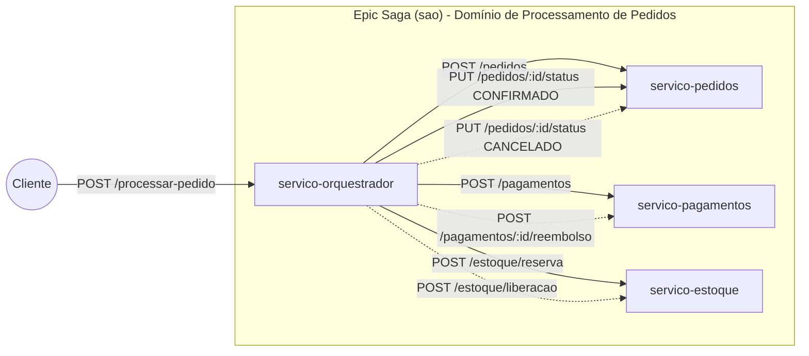
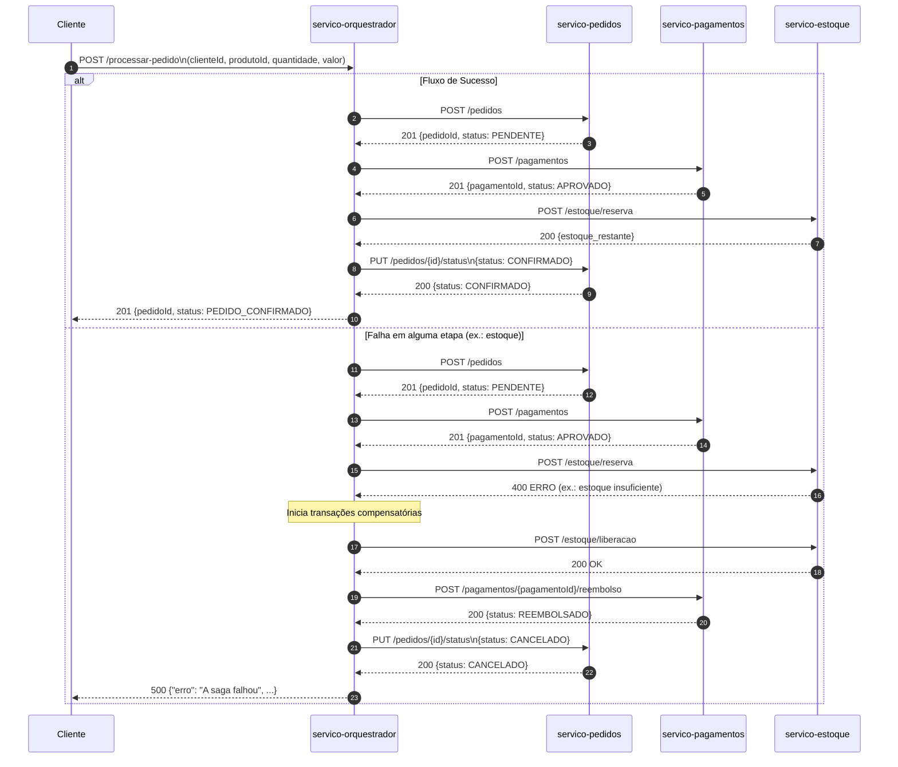

# 📘 **README – Projeto Saga Transacional (Epic Saga – Orquestrada)**

### Engenharia de Computação – Sistemas Distribuídos

### Simulação de Processamento de Pedidos em Microserviços

Alunos: Víctor Teixeira e Sthéphany Vidal

---

## 📌 **1. Objetivo**

Este projeto implementa uma simulação completa do padrão **Epic Saga (SAO)** utilizando **microserviços** independentes que executam etapas do processamento de um pedido em um sistema de e-commerce.

A saga garante consistência entre os serviços por meio de:

* **Transações locais**
* **Compensações em caso de falha**
* **Orquestração centralizada**
* **Comunicação síncrona entre microserviços**

A solução foi construída conforme o enunciado do exercício oficial. 

---

## 📦 **2. Arquitetura do Sistema**

O sistema é composto por **4 microserviços** independentes:

| Serviço                  | Função                        | Porta |
| ------------------------ | ----------------------------- | ----- |
| **servico-orquestrador** | Coordena toda a saga          | 3000  |
| **servico-pedidos**      | Cria pedidos e altera status  | 3001  |
| **servico-pagamentos**   | Processa e estorna pagamentos | 3002  |
| **servico-estoque**      | Reserva e libera estoque      | 3003  |

---

## 🔄 **3. Fluxo Completo da Saga**

### 🟩 **Fluxo de Sucesso**

1. Cliente envia `POST /processar-pedido`
2. Orquestrador cria pedido com status **PENDENTE**
3. Pagamento é aprovado
4. Estoque é reservado
5. Orquestrador altera status para **CONFIRMADO**
6. Retorna pedido confirmado ao cliente

### 🟥 **Fluxo com Falha (Saga Compensatória)**

Se qualquer etapa falhar, o orquestrador executa:

1. **Liberação de estoque**
2. **Estorno de pagamento**
3. **Cancelamento do pedido**

---

## 🔧 **4. Tecnologias Utilizadas**

* Node.js
* Express.js
* Axios
* Comunicação HTTP síncrona entre microserviços
* Banco em memória (objetos JavaScript)

---

## 🚀 **5. Como executar o projeto**

### 1) Instale dependências em cada serviço

```bash
npm install
```

### 2) Rode cada microserviço:

```bash
# Na pasta servico-pedidos
node server.js

# Na pasta servico-pagamentos
node server.js

# Na pasta servico-estoque
node server.js

# Na pasta servico-orquestrador
node server.js
```

---

## 🔥 **6. Testando a Saga**

### ➤ **Requisição (fluxo normal):**

**POST** `http://localhost:3000/processar-pedido`

```json
{
  "clienteId": "cliente-123",
  "produtoId": "produto-abc",
  "quantidade": 1,
  "valor": 150.00
}
```

### ✔️ **Resposta de Sucesso (201):**

```json
{
  "pedidoId": "pedido-173161893",
  "status": "PEDIDO_CONFIRMADO"
}
```

---

## 💥 **7. Simulação de Falha**

Segundo o enunciado, falhas podem ser simuladas assim:

| Situação               | Resultado          |
| ---------------------- | ------------------ |
| `produtoId = 0`        | Falha no pagamento |
| `valor >= 1000`        | Pagamento recusado |
| `quantidade > estoque` | Falha no estoque   |

### Exemplo gerando falha proposital:

```json
{
  "clienteId": "cliente-123",
  "produtoId": 0,
  "quantidade": 1,
  "valor": 150.00
}
```

### 🔁 **Resposta (500 – Saga Compensatória ativada)**

```json
{
  "erro": "A saga falhou",
  "motivo": {
    "erro": "Pagamento recusado"
  },
  "pedidoId": "pedido-173161893"
}
```

---

## 🧩 **8. Endpoints Implementados**

### ✔️ **servico-orquestrador**

* `POST /processar-pedido`

### ✔️ **servico-pedidos**

* `POST /pedidos`
* `PUT /pedidos/{id}/status`

### ✔️ **servico-pagamentos**

* `POST /pagamentos`
* `POST /pagamentos/{id}/reembolso`

### ✔️ **servico-estoque**

* `POST /estoque/reserva`
* `POST /estoque/liberacao`

---

## 🗂️ **9. Visão de Arquitetura (Componentes da Saga)**



---

## 🗂️ **10. Fluxo da Saga (Sucesso + Compensação)**



---

## 🧠 **11. O que este projeto demonstra?**

* Orquestração síncrona entre microserviços
* Tratamento transacional distribuído
* Execução de **transações compensatórias**
* Gerenciamento de consistência eventual
* Tolerância a falhas simulada
* Arquitetura escalável e desacoplada

---

## 🎓 **12. Conclusão**

Este projeto demonstra de forma prática como aplicar o padrão **Epic Saga (SAO)** para garantir consistência em cenários distribuídos que envolvem múltiplos microserviços.
